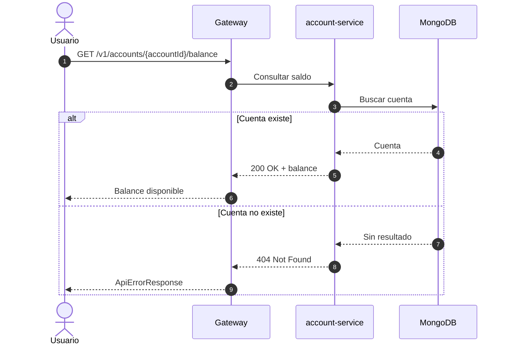
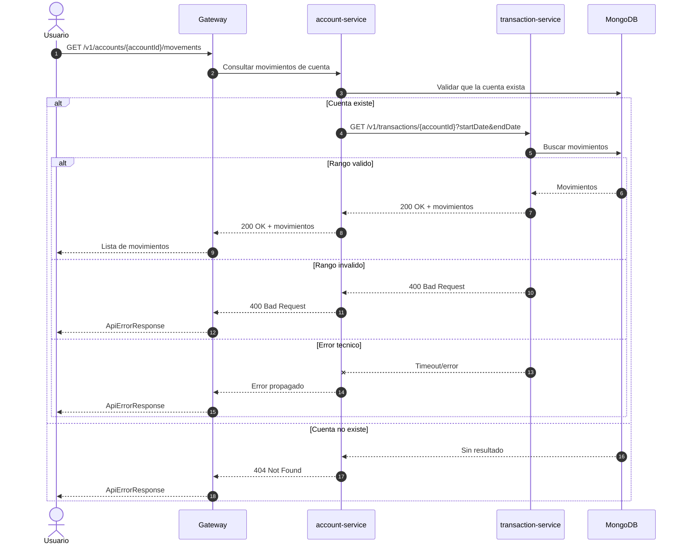

# Diagrama de secuencia - Consultas de cuenta, saldo y movimientos

Estos flujos son síncronos por HTTP y no publican eventos Kafka.

## Consultar saldo disponible

```mermaid
sequenceDiagram
    autonumber
    actor Usuario
    participant Gateway
    participant Account as account-service
    participant MongoDB

    Usuario->>Gateway: GET /v1/accounts/{accountId}/balance
    Gateway->>Account: Consultar saldo
    Account->>MongoDB: Buscar cuenta

    alt Cuenta existe
        MongoDB-->>Account: Cuenta
        Account-->>Gateway: 200 OK + balance
        Gateway-->>Usuario: Balance disponible
    else Cuenta no existe
        MongoDB-->>Account: Sin resultado
        Account-->>Gateway: 404 Not Found
        Gateway-->>Usuario: ApiErrorResponse
    end
```

## Consultar movimientos

```mermaid
sequenceDiagram
    autonumber
    actor Usuario
    participant Gateway
    participant Account as account-service
    participant Transaction as transaction-service
    participant MongoDB

    Usuario->>Gateway: GET /v1/accounts/{accountId}/movements
    Gateway->>Account: Consultar movimientos de cuenta
    Account->>MongoDB: Validar que la cuenta exista

    alt Cuenta existe
        Account->>Transaction: GET /v1/transactions/{accountId}?startDate&endDate
        Transaction->>MongoDB: Buscar movimientos

        alt Rango valido
            MongoDB-->>Transaction: Movimientos
            Transaction-->>Account: 200 OK + movimientos
            Account-->>Gateway: 200 OK + movimientos
            Gateway-->>Usuario: Lista de movimientos
        else Rango invalido
            Transaction-->>Account: 400 Bad Request
            Account-->>Gateway: 400 Bad Request
            Gateway-->>Usuario: ApiErrorResponse
        else Error tecnico
            Transaction--x Account: Timeout/error
            Account-->>Gateway: Error propagado
            Gateway-->>Usuario: ApiErrorResponse
        end
    else Cuenta no existe
        MongoDB-->>Account: Sin resultado
        Account-->>Gateway: 404 Not Found
        Gateway-->>Usuario: ApiErrorResponse
    end
```
