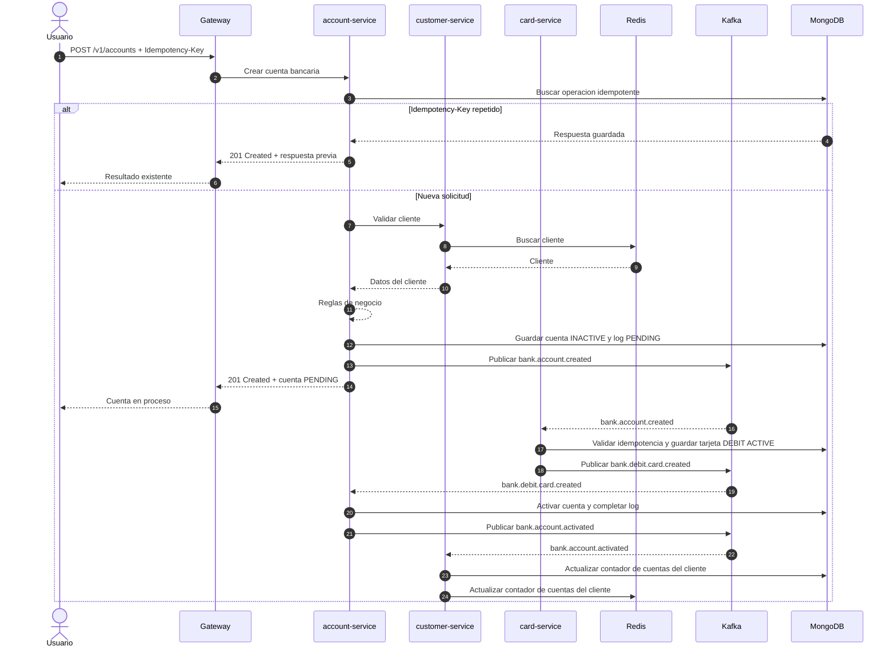
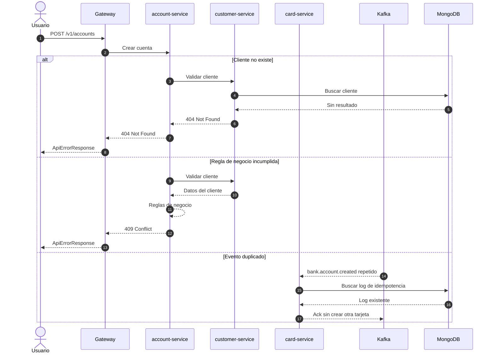

# Diagrama de secuencia - Creación de cuenta bancaria y tarjeta de débito

La cuenta se crea inicialmente como `PENDING/INACTIVE`. Luego `card-service` crea la tarjeta de débito por Kafka, `account-service` activa la cuenta y `customer-service` actualiza sus contadores.

## Flujos alternativos

