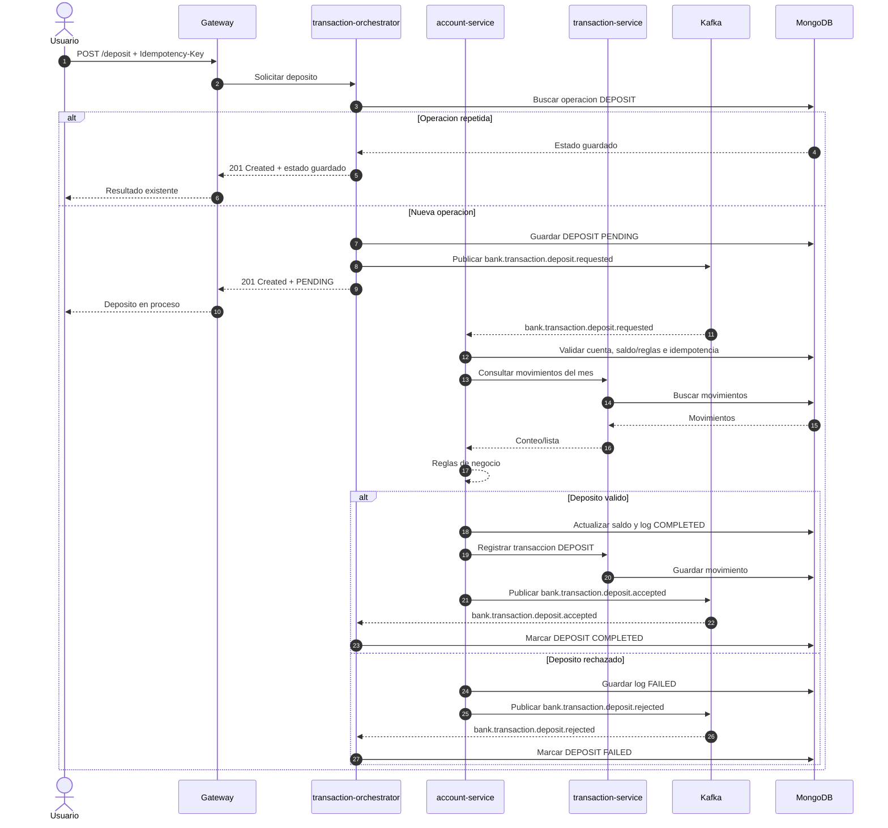
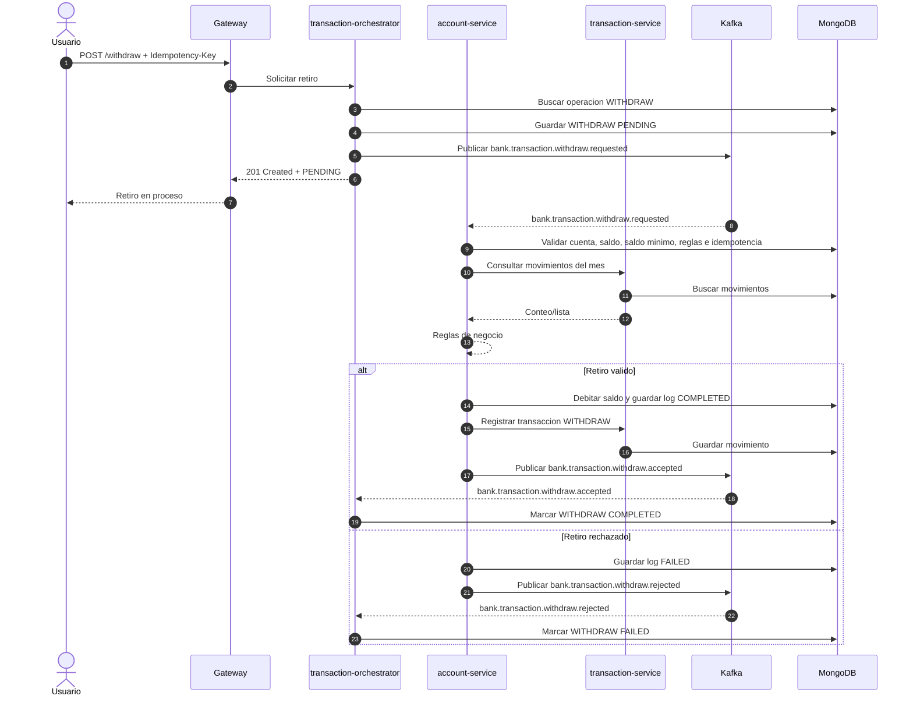

# Diagrama de secuencia - Depósito y retiro de cuenta bancaria

Los depósitos y retiros se inician en `transaction-orchestrator`, se ejecutan en `account-service`, se registran en `transaction-service` y se cierran en el orquestador por Kafka.

## Depósito

## Retiro

## Motivos de rechazo

- Cuenta inexistente o inactiva.
- Monto menor o igual a cero.
- Moneda distinta a la cuenta.
- Cuenta de plazo fijo fuera del día permitido.
- Límite mensual de movimientos excedido.
- Retiro sin saldo suficiente, comisión incluida.
- Retiro que deja saldo por debajo del mínimo permitido.
- Error o timeout al consultar/registrar movimientos en `transaction-service`.
