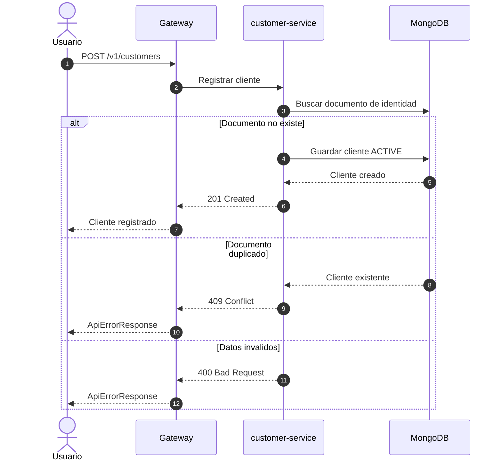
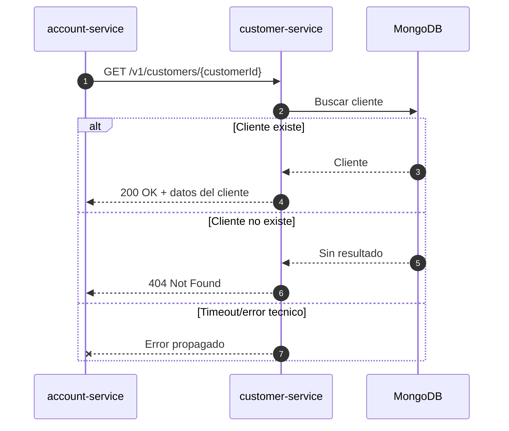

# Diagrama de secuencia - Registro de cliente

Flujo de alta de cliente. No usa Kafka; la operación se resuelve de forma síncrona contra MongoDB.

## Consulta de cliente desde otro servicio

`account-service` consulta `customer-service` para validar la existencia y perfil del cliente antes de crear una cuenta.

