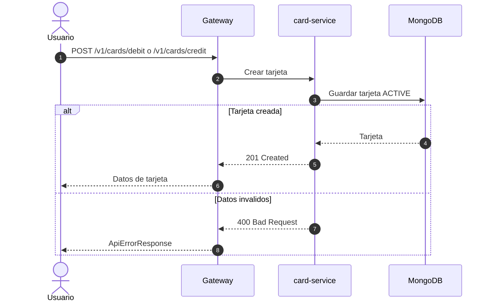
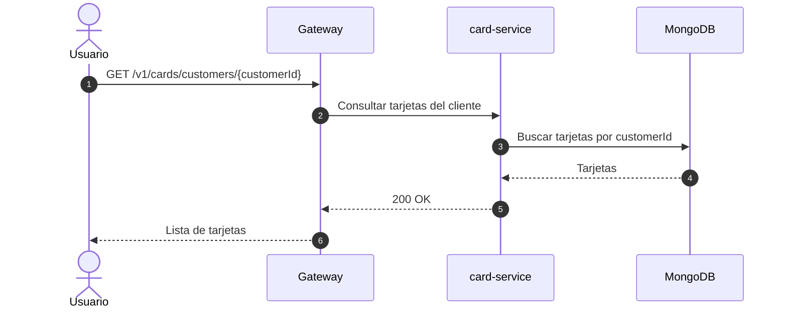
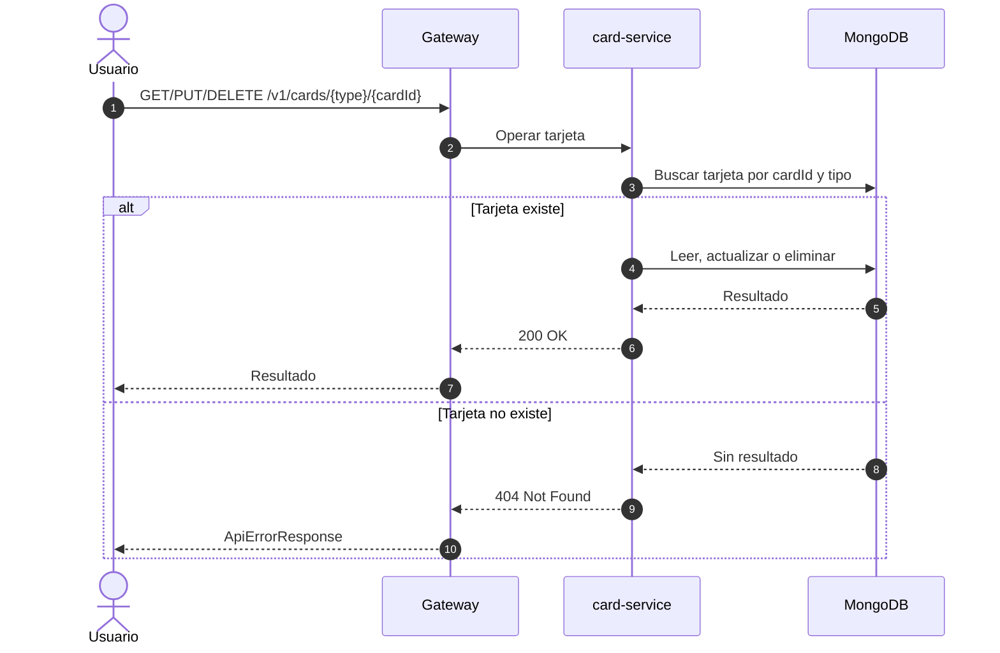

# Diagrama de secuencia - Tarjetas de débito y crédito

Estos diagramas cubren los endpoints directos de `card-service`. La creación automática de tarjeta de débito al crear una cuenta está en [creación de cuenta y tarjeta de débito](./secuencia-creacion-cuenta-tarjeta-debito.md).

## Crear tarjeta

## Consultar tarjetas de un cliente

## Consultar, actualizar o eliminar una tarjeta

## Alcance actual

El código actual crea tarjetas de crédito directamente en `card-service`. No se ve todavía un flujo implementado que consulte `overdue-debt-service`, cree una cuenta en `credit-card-account-service` o publique eventos para ciclo de facturación.
